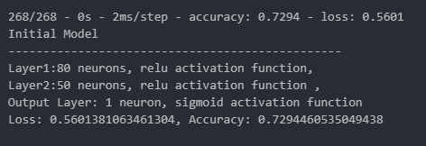
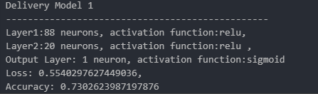
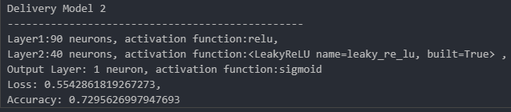
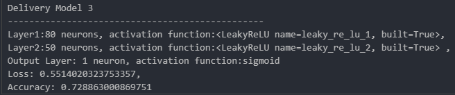

# Alphabet Soup Grant Success Classifier: A Machine Learning Approach
# Analysis Report
## Overview
Alphabet Soup, a nonprofit foundation wants to design a tool that can help it select the applicants for funding with the best chance of success in their ventures.
The primary objective is to design and evaluate multiple deep learning models to determine which architecture offers the best performance in terms of accuracy. The designed predictive model will support Alphabet Soup in making more informed and strategic funding decisions.

## Results
### Data Preprocessing
* 1. Variable dropped from the input data 
    * Identification columns EIN and NAME 

* 2. Features for the model
    * APPLICATION_TYPE—Alphabet Soup application type
    * AFFILIATION—Affiliated sector of industry
    * CLASSIFICATION—Government organization classification
    * USE_CASE—Use case for funding
    * ORGANIZATION—Organization type
    * STATUS—Active status
    * INCOME_AMT—Income classification
    * SPECIAL_CONSIDERATIONS—Special considerations for application
    * ASK_AMT—Funding amount requested

* 3. Target for the model
    * IS_SUCCESSFUL—Was the money used effectively

### Compiling, Training, and Evaluating the Model
* 1. Initial Model
                
#### Attempts to increase model performance (for epochs = 100 and input features = 44)
* 1. Deliverable Model 
                
* 2. Deliverable Model 2
                
* 3. Deliverable Model 3
                

#### Steps to increase model performance
Across the four models, I experimented with 2 hidden layers and varied the number of neurons and activation functions to evaluate performance:
Neurons:Ranged from 80–90 in the first layer and 20–50 in the second layer.The selection was based on the idea that more neurons in early layers can help the model learn complex patterns, while fewer in later layers can reduce dimensionality and overfitting.
Activation Functions:Initially used ReLU (Rectified Linear Unit), which is commonly effective in deep learning due to its simplicity and efficiency.
Later replaced with Leaky ReLU (with alpha = 0.1) in Deliverables 2 and 3 to address the "dying ReLU" problem—where neurons output 0 for all inputs, stopping learning.
Output Layer:Always used 1 neuron with a sigmoid activation function, appropriate for binary classification problems.

Despite multiple adjustments, the best accuracy achieved was 73.02% in Deliverable 1 and the target model performance was not achieved.

## Summary 
Model Accuracy: Ranged from 72.80% to 73.02%—an incremental improvement, but below the 75% target.
Loss:Improved slightly from 0.56 to 0.55, indicating minor improvements.

### Recommendations for Further Improvement
* Add a Third Hidden Layer - Introducing an additional hidden layer could help capture deeper patterns in complex data.
* Optimize the Learning Rate - Use learning rate schedulers or optimizers like Adam with decay to fine-tune training.
* Feature Engineering - Ensure the input features are meaningful. Use PCA, correlation analysis, or recursive feature elimination to select the most relevant ones.

